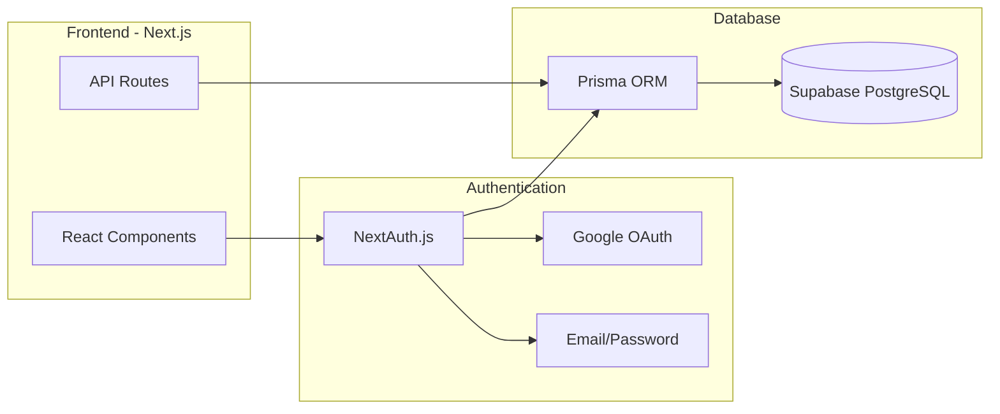
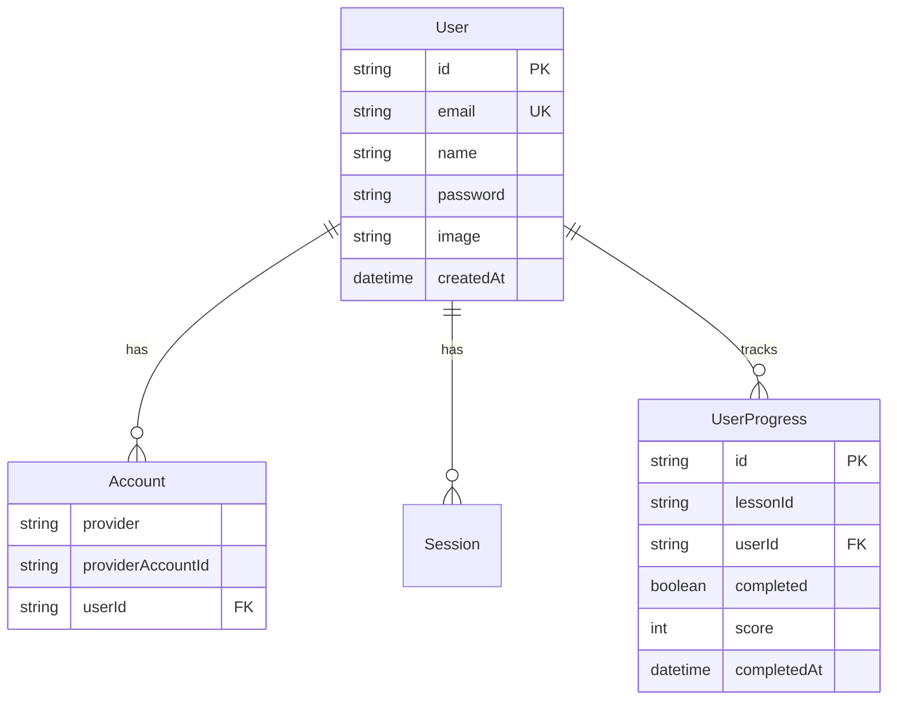

# PRD: Authentication System

> Task 01 - Phase 2 (Backend)

---

## Thông tin

| Field | Value |
|-------|-------|
| Task ID | 01-authentication |
| Trạng thái | **ĐANG LÊN KẾ HOẠCH** |
| Ngày tạo | 2026-01-26 |

---

## Mục tiêu

Xây dựng hệ thống authentication với NextAuth.js, Supabase PostgreSQL và Prisma ORM. Hỗ trợ đăng nhập Email/Password và Google OAuth.

---

## Tech Stack được chọn

- **Auth**: NextAuth.js (Auth.js) v5 - miễn phí, open source
- **Database**: Supabase PostgreSQL - free tier (500MB, 50k users/tháng)
- **ORM**: Prisma - type-safe database queries
- **Hosting**: Vercel - free tier đủ dùng cho scale nhỏ

---

## Kiến trúc tổng quan



---

## Database Schema



---

## Các bước triển khai (Todos)

| # | Task | Trạng thái |
|---|------|------------|
| 1 | Hướng dẫn tạo Supabase project và lấy connection string | Chờ |
| 2 | Cài đặt NextAuth, Prisma, bcryptjs và các dependencies | Chờ |
| 3 | Tạo Prisma schema với User, Account, Session, UserProgress models | Chờ |
| 4 | Cấu hình NextAuth với Credentials + Google provider | Chờ |
| 5 | Tạo trang Login và Register | Chờ |
| 6 | Tạo API endpoints cho lesson progress tracking | Chờ |
| 7 | Update Header với user menu và các components để check tiến độ | Chờ |

---

## Chi tiết triển khai

### 1. Setup Supabase (Free Tier)

- Tạo project tại [supabase.com](https://supabase.com)
- Lấy connection string cho Prisma

### 2. Cài đặt dependencies

```bash
npm install next-auth@beta @auth/prisma-adapter prisma @prisma/client bcryptjs
npm install -D @types/bcryptjs
```

### 3. Setup Prisma Schema

Tạo file `tepup/prisma/schema.prisma` với các models:
- User, Account, Session (cho NextAuth)
- UserProgress (cho tracking lesson progress)

### 4. Cấu hình NextAuth.js

Tạo file `tepup/app/api/auth/[...nextauth]/route.ts`:
- Credentials provider (email/password)
- Google provider
- Prisma adapter kết nối Supabase

### 5. Tạo API Endpoints cho User Progress

- `POST /api/progress` - Đánh dấu lesson/chapter hoàn thành
- `GET /api/progress` - Lấy tiến độ của user

### 6. Update Frontend Components

- Thêm nút Login/Logout vào Header
- Tạo trang đăng nhập/đăng ký
- Update `LessonNode` và `ChapterNode` để check tiến độ từ database

---

## Files sẽ tạo/sửa

**Tạo mới:**
- `tepup/prisma/schema.prisma` - Database schema
- `tepup/app/api/auth/[...nextauth]/route.ts` - NextAuth config
- `tepup/lib/auth.ts` - Auth utilities
- `tepup/lib/prisma.ts` - Prisma client
- `tepup/app/login/page.tsx` - Trang đăng nhập
- `tepup/app/register/page.tsx` - Trang đăng ký
- `tepup/app/api/progress/route.ts` - API tiến độ học tập
- `tepup/.env.local` - Environment variables

**Sửa:**
- `tepup/components/Header.tsx` - Thêm user menu
- `tepup/package.json` - Thêm dependencies

---

## Chi phí ước tính

| Service | Free Tier | Khi scale lên |
|---------|-----------|---------------|
| Supabase | 500MB, 50k users | $25/tháng cho 8GB |
| Vercel | 100GB bandwidth | $20/tháng cho Pro |
| Google OAuth | Miễn phí | Miễn phí |

**Tổng**: Miễn phí cho giai đoạn đầu, ~$45/tháng khi scale

---

## Feedback & Changes

*(Ghi nhận các feedback và thay đổi trong quá trình thực hiện)*

| Ngày | Feedback | Thay đổi |
|------|----------|----------|
| - | - | - |

---

## Notes

- Ưu tiên đơn giản và hoạt động trước, tối ưu sau
- Free tier của Supabase và Vercel đủ cho giai đoạn MVP
- Có thể mở rộng dễ dàng khi cần
